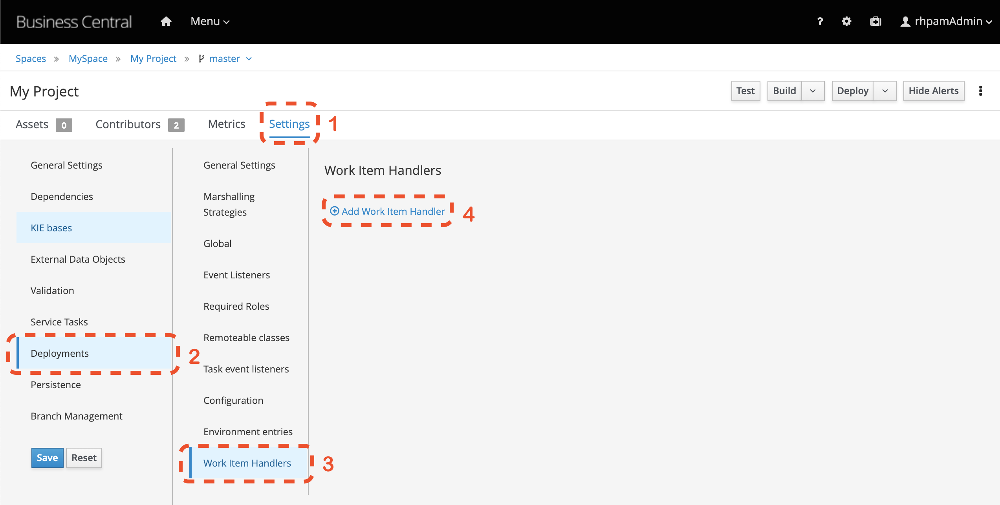
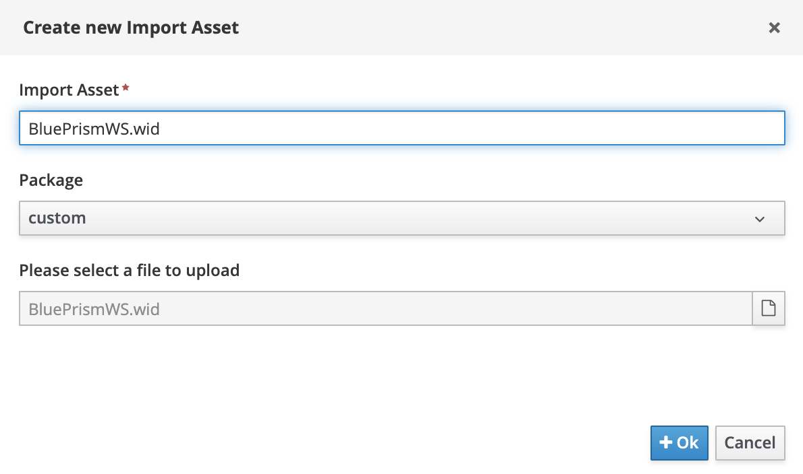
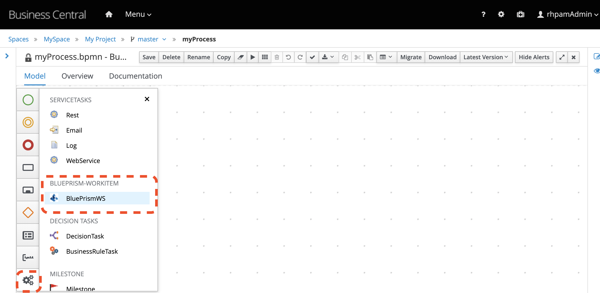
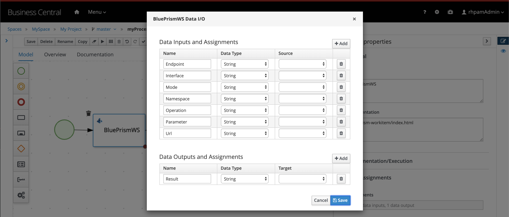
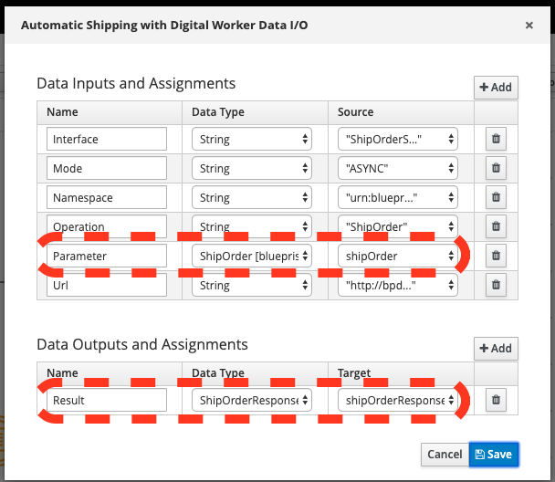
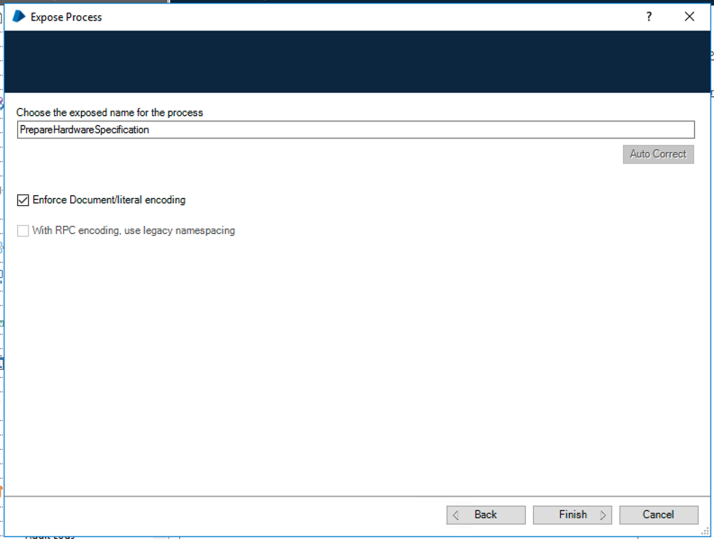

:scrollbar:
:toc4:
:linkattrs:

# Integrating Red Hat Process Automation Manager with BluePrism Digital Workforce

## Introduction

This guide contains instructions and best practices for integrating Red Hat Process Automation Manager (RHPAM) with Blue Prism Intelligent RPA Platform, so that both products can work together effectively to automate business operations.

RHPAM is a Business Process Management System.  It orchestrates the movement of work through a series of steps in a business process.  For example, it may be used to move an insurance claim through a claims process, ensuring that the claim is routed through the various steps needed to determine its validity, determine a payment, comply with insurance regulations, comply with corporate policies, etc.

Blue Prism is a Robotic Process Automation platform.  It enables the work performed at an individual step in a business process to be completed automatically by a software robot, instead of a human worker.  For example, checking that an insurance claim contains all required information, updating a system of record with the claim details, etc.

Combining a BPM system such as RHPAM with an RPA platform such as Blue Prism confers several advantages, including the ability to automate more of the time consuming and expensive manual labor than would be possible with either product alone.  For more information on the value of combining various business automation technologies see this https://www.gartner.com/document/3900986[excellent report] from Gartner.

## Pre-requisites

* BluePrism 6;
* Red Hat Process Automation Manager (RHPAM) 7.5 (or higher);
* Custom BluePrism Task (WIH)
** Source code available at:
** Compiled jar available at:

## BluePrism

BluePrism is supported on Windows. You can install it on premise or spawn machines in Azure cloud to model and execute your robots. More details can be found at [Insert links here].

Once you have the platform up and running, these is an overview of items to work on:

- Model objects and/or processes that can execute the repeatable task;
- Expose processes via Web Services API. _Use literal encoding [4]._
- Configure firewalls to allow access to the host and port where BluePrism is running, which is by default `8181`;
** If running on Azure, also configure the inbound and outbound network configuration to allow external access to BluePrism machine;

## RHPAM

RHPAM is Java based, and can run on several operating system that supports Java like Windows and Linux [https://access.redhat.com/articles/3405381]. It can either be provisioned on premise or within a Kubernetes-based platform like OpenShift.

When invoking Digital Workforce within RHPAM processes, communication happens via SOAP [1]. So in order to invoke BluePrism WebService, it is possible either use the default Web Service Task which comes out-of-the-box within RHPAM, or, create a custom task to represent this invocation. In this guide, we will show how to use BluePrism Task[link to repo here], a custom task to accomplish this goal [2].

### Configuring Business Central

#### Installing BluePrism Task

In order to use a custom task, you first need to make it available. Here’s how you can install the BluePrism Task within the RHPAM authoring environment (Business Central):

1. Login to Business Central, go to the general settings by selecting the gear icon on the top-right corner menu.
2. Within the configuration page, select the Service Tasks Administration option.

image::images/1-service-tasks.png[]

[start=3]
3. Upload the jar package that contains the BluePrism Task.

* Click on the `Add Service Task` button
* Provide the jar contaning the custom task, in this case, the file `blueprism-wih-7.23.0.Final-redhat-00003.jar`.
[#TODO check the error that is ocurring on pam 750 18:50:28,212 ERROR [io.undertow.request] (default task-9) UT005023: Exception handling request to /business-central/maven2: java.lang.RuntimeException: org.eclipse.aether.deployment.DeploymentException: Failed to deploy artifacts: Could not transfer artifact org.jbpm.contrib:blueprism-wih:jar:7.23.0.Final-redhat-00003 from/to jboss-releases-repository (https://repository.jboss.org/nexus/service/local/staging/deploy/maven2/): repository.jboss.org]

The BluePrism Service Task should now be available within the authoring environment. To use the task in the process designer, it is necessary to enable and configure it at the project level.

#### Adding BluePrism Task to a Business Project

Follow these steps to enable the BluePrism task in a RHPAM project:

1. In Business Central, go to the projects view, select a space, and open the project settings.
*  Select the `settings` tab, and next, `Deployments`. Locate and select the `Work Item  Handlers` menu.
* Click on `Add Work Item Handler`.


[start=3]
3. Input the task (Work Item Handler) configuration. See this example:

* *Name*: `BluePrismWS`;
* *Value*:
```
new com.redhat.demo.BluePrismWSWorkItemHandler(ksession,classLoader,5000,"user","password")
```
On the above task configuration notice that: `5000` is the request timeout in miliseconds; You have to replace the values `user` and `password`with valid credentials for the blueprims webservices you are connecting to.

[start=4]
4. Identify or create the package in which the processes will be stored. You can either install the task to be visible to all processes (adding it to the global folder of the project) or just to a specific group of processes. In this guide, we will configure the task for a group of processes under a specific package.

5. Click on `import` button and choose the package you defined on step 4.
* Import the `bp-icon.png`[#TODO add link] and the `BluePrismWS.wid`[#TODO add link] files to this package.
* See an example below where the processes would be stored in a package named `custom`:



#### Using the BluePrism Task within a Process

You can now use a BluePrism task to invoke Digital Workers via the BluePrism SOAP Web Services.



This custom BluePrism task is an extension of the RHPAM WebService Task. More information about it can be found here[#TODO add link].

Once you open the task properties `Data Assignments`,  it should display the following configurations by default:



You will find details about each configuration below. Let’s consider a task which triggers a SOAP WebService like `PrepareHardwareSpecification.wsdl`.

* Data Inputs and Assignments
** *Namespace*: Namespace of BluePrism SOAP Service. Example: `urn:blueprism:webservice:preparehardwarespecification`
** *Interface*: Interface of BluePrism SOAP Service. Example: `PrepareHardwareSpecificationService`
** *Mode*: Can be `SYNC` or `ASYNC`.
** *Operation*: BluePrism SOAP Service operation to invoke. Example: `PrepareHardwareSpecification`
** *Url*: Accessible URL where BluePrism Service is available. Example: http://myblueprism:8181/ws/PrepareHardwareSpecification?wsdl
** *Parameter*: The process variable that will be sent as an input parameter. The `Data Type` should be set according to the process variable class.

* Data Outputs and Assignments
** *Result* : process variable where the engine will store the result once it is received in the response. The `Data Type` should be set according to the process variable class.

##### Using Complex Java Objects within Request and Response

When working with SOAP integration, PAM can work with automatic object marshaling. In order to do that, it is necessary to create the objects which the Web Service expects to receive in the request, and the object in that will be sent back in the response.

To make this creation easier, the developer can use CXF to automatically generate the classes to be used from the BluePrism’s WSDL. There is a script named wsconsume.sh[4] which is included in Red Hat JBoss EAP default installation. _Red Hat JBoss EAP is the application server generally used to run RHPAM._

See how you can generate the WS Objects using the `wsconsume.sh` script:

1. Once the BluePrism Web Service is available, it is possible to open the terminal and invoke `wsconsume.sh` to generate the classes. The script can be found under `$JBOSS_EAP/bin/wsconsume.sh`

```
wsconsume.sh [options] <wsdl-url>
```

See this example:

```
$JBOSS_HOME/bin/wsconsume.sh -kn http://bpdevelopment:8181/ws/PrepareHardwareSpecification?wsdl
```

* Where `$JBOSS_HOME` is the directory where JBoss is installed;
* The parameters used means:
** *-k*: same as `--keep` Keep/Generate Java source;
** *-n*: same as `--nocompile` Do not compile generated sources;
* *URL*: should be replaced with the wsdl url, for example http://bpdevelopment:8181/ws/ShipOrder?wsdl.

[start=2]
2. A folder with the package structure and respective classes should be generated in `$JBOSS_HOME/bin/output/`.

3. Import the generated classes related to the wsdl into your business project (_Or package it within a `jar` and reference it as a dependency_). The following classes are the necessary ones for this interaction:

* `ObjectFactory.java`
* `package-info.java`
* `POJOResponse.Java`
* `POJO.java`

4. Once imported to the project, add the respective input and output classes to the task variables `Parameter` and `Result`:

* Make sure to select the class type you just generated on the `Data Type` combo box.

* On the `source` column:
** for the `input` select the process variable where the input value can be obtained to be sent to BluePrism;
** for the `output`, select the process variable where the response object received from BluePrism should be stored;


# Summary

Here are the topics you should remember when creating Red Hat PAM processes that consumes BluePrism services:

1. Expose BluePrism processes or objects via WebService;
2. To use CXF based scripts (`wsconsume.sh`), BluePrism SOAP WebService should be exposed with literal encoding [3];
3. If running on a different machine, BluePrism should be externally accessible (Firewalls should be configured).
4. BluePrism should be accessible from within services running in different machines (Firewalls should be configured).
5. The project within Red Hat PAM needs an additional configuration for the service task that invokes SOAP Web Services (or custom service tasks).
6. If using automatic marshalling for complex java objects, the classes should be added in the business project or packaged and added as a maven dependency. These classes can be generated with `wsconsume.sh` script.

# General Notes:

* *[1]* _BluePrism Web Services are currently exposed only via SOAP._
* *[2]* _Red Hat supports for RHPAM the creation and usage of custom tasks, although the code within the custom task is not supported. Therefore, the task provided on this guide is for demonstration purposes only and is not officially supported_.
* *[3]* _Due to a known behavior on the designer, this guide instructs to user to manually copy the icon task. This will be improved on next releases. More details can be found in https://issues.redhat.com/browse/RHPAM-2418._
* *[4]* CXF does not support creating classes for Rpc/encoded wsdls. To use it, BluePrism Web Service must be exposed with literal encoding, like represented on the image below:


.
