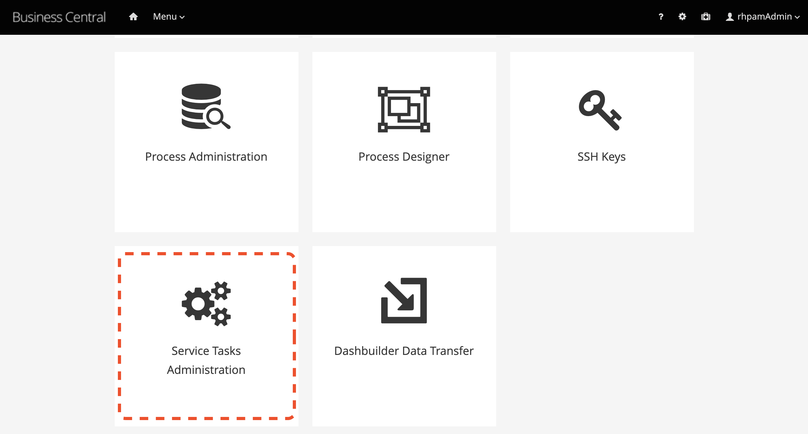

:scrollbar:
:toc2:
:linkattrs:

# Integrating Red Hat Process Automation Manager with BluePrism Digital Workforce

## Introduction

This guide shows technical details on how to integrate Red Hat Process Automation Manager (RHPAM) with BluePrism. By integrating these platforms the organization can benefit from both worlds: Business Process Automation and Robotic Process Automation.

A business automation platform provides tooling that allows  processes and cases authoring based on mature specifications like BPMN2 and CMMN, respectively for processes and cases. It also supports decision automation, based on the DMN specification and also with several other business-friendly ways to automate business rules. Finally, this platforms provides a management and an execution environment, that can gather real-time valuable KPIs to be used by the C-level for decision making.

With this, the automation of business process and decisioning is not focused on granular processes, on the contrary, it spawns horizontally across the organization areas.

On the RPA world, we find software which allows the creation of robots to automate manual tasks. These robots can interact with desktop applications, web applications, spreadsheets, e-mail inboxes and many other different tools. This means that any repeatable work mainly executed by a human can be automated, therefore, the execution can be replaced by as many number of robots as needed.

When aligning the usage of an RPA tool with a business automation platform, we expand our digital automation to a scenario where the corporation repeatable work is made efficient and the business process management practice is supported in its entirety.

There are several advantages on this approach:
- Being able to track the organization functioning across process monitoring that includes robots tasks;
- Being able to identify bottlenecks on the organization functioning through a business automation platform and taking the action of improving it by using robot automation;
- Using digital workers to make your process function whenever: including weekends.
- Be able to easily scale the number of digital workers for seasional process needs;

Knowing this, Red Hat and BluePrism aligned forces to work together and provide even more ways for users to be successful. RHPAM is an open-source platform for intelligent process and decisioning automation. BluePrism, is an RPA tool that provides tool for creating, executing and monitoring robots - Digital Workers - supporting the automation of repeatable tasks.

With this in mind, this document has technical details on how it is possible to use BluePrism digital workers within business processes or cases created in RHPAM to efficiently accomplish business goals.

## Pre-requisites

* BluePrism 6;
* Red Hat Process Automation Manager (RHPAM) 7.5 (or higher);
* Custom BluePrism Task (WIH) [2]
** Source code available at:
** Compiled jar available at:

## BluePrism

BluePrism is supported on Windows. You can install it on premise or spawn machines in Azure cloud to model and execute your robots. More details can be found at [Insert links here].

Once you have the platform up and running, these is an overview of items to work on:

- Model objects and/or processes that can execute the repeatable task;
- Expose processes via Web Services API. _Use literal encoding [4]._
- Configure firewalls to allow access to the port where BluePrism is running, which is by default `8181`;
** If running on Azure, also configure the inbound and outbound network configuration to allow external access to BluePrism machine;

## RHPAM

RHPAM is Java based therefore it can run in all operation systems that currently supports Java. It can either be provisioned on premise or within a Kubernetes-based platform like OpenShift.

When invoking Digital Workforce within RHPAM processes, communication happens via SOAP [1]. So in order to invoke BluePrism WebService, it is possible either use the default Web Service Task which comes out-of-the-box within RHPAM, or, create a custom task to represent this invocation. In this guide, we will show how to use BluePrism Task[link to repo here], a custom task to accomplish this goal [2].

### Configuring Business Central

#### Installing BluePrism Task

In order to use a custom task, first make it available. Here's how you can install the BluePrism Task within the authoring environment:

1. Login to Business Central, go to the general settings by selecting the `gear` icon on the top-right corner menu.
2. Within the configuration page, select the `Service Tasks Administration` option.



[start=3]
3. Upload the jar package that contains the BluePrism Task.
* Click on the `Add Service Task` button
* Provide the jar contaning the custom task, in this case, the file `blueprism-wih-7.23.0.Final-redhat-00003.jar`.
[#TODO check the error that is ocurring on pam 750 18:50:28,212 ERROR [io.undertow.request] (default task-9) UT005023: Exception handling request to /business-central/maven2: java.lang.RuntimeException: org.eclipse.aether.deployment.DeploymentException: Failed to deploy artifacts: Could not transfer artifact org.jbpm.contrib:blueprism-wih:jar:7.23.0.Final-redhat-00003 from/to jboss-releases-repository (https://repository.jboss.org/nexus/service/local/staging/deploy/maven2/): repository.jboss.org]

The BluePrism Service Task should now be available within the authoring environment. To use it during the process design it is necessary to configure it in the project level.

#### Adding BluePrism Task to a Business Project

Follow this steps to allow using BluePrism task in a specific project:

1. In Business Central, go to the projects view, select a space and open the project settings.
*  Select the `settings` tab, and next, `Deployments`. Locate and select the `Work Item  Handlers` menu.
* Click on `Add Work Item Handler`.
image:images/2-project-config.png[]

[start=3]
3. Input the task (Work Item Handler) configuration. See this example:

* *Name*: `BluePrismWS`;
* *Value*:
```
new com.redhat.demo.BluePrismWSWorkItemHandler(ksession,classLoader,5000,"user","password")
```
On the above task configuration notice that: `5000` is the request timeout in miliseconds; On the `Value` field replace the `user` and `password` with valid connection credentials for the blueprism web services you are connecting to.

[start=4]
4. Identify or create the package where the processes will be stored. You can either install the task to be visible for all processes authoring (adding it to the global folder of the project) or just for a specific group of processes. In this guide, we will configure the task for a group of processes under a specific package.

5. Click on `import` button and choose the package you defined on step 4.
* Import the `bp-icon.png`[#TODO add link] and the `BluePrismWS.wid`[#TODO add link] files to this package.
* See an example below where the processes would be stored in a package named `custom`:

image:images/3-import-wid.png[]

#### Using the BluePrism Task within a Process

You can now use a BluePrism task to invoke Digital Workers via BluePrism SOAP Web Services.

image:images/4-blueprism-wih.png[]

This custom BluePrism task is an extension of the RHPAM `WebService Task`. More information about it can be found here[#TODO add link].

Once you open the task properties `Data Assignments`, it should display by default the following configurations:

image:images/5-blueprism-wih-parameters.png[]

See more details about each configuration below. Let's consider a task which triggers a SOAP WebService like `PrepareHardwareSpecification.wsdl`.

* Data Inputs and Assignments
** *Namespace*: Namespace of BluePrism SOAP Service. Example: `urn:blueprism:webservice:preparehardwarespecification`
** *Interface*: Interface of BluePrism SOAP Service. Example: `PrepareHardwareSpecificationService`
** *Mode*: Can be `SYNC` or `ASYNC`.
** *Operation*: BluePrism SOAP Service operation to invoke. Example: `PrepareHardwareSpecification`
** *Url*: Accessible URL where BluePrism Service is available. Example: http://myblueprism:8181/ws/PrepareHardwareSpecification?wsdl
** *Parameter*: The process variable that will be sent as an input parameter. The `Data Type` should be set according to the process variable class.

* Data Outputs and Assignments
** *Result* : process variable where the engine will store the result once it is received in the response. The `Data Type` should be set according to the process variable class.

##### Using Complex Java Objects within Request and Response

When working with SOAP integration, PAM can work with automatic object masharling. In order to do that, it is necessary to create the objects which the Web Service expects to receive in the request, and the object in that will be sent back in the response.

To make this creation easier, the developer can use CXF to automatically generate the classes to use during the integration. There is a script named `wsconsume.sh`[4] which is included in Red Hat JBoss EAP default installation. _Red Hat JBoss EAP is the application server generally used to run RHPAM._

See how you can generate the WS Objects using the `wsconsume.sh` script:

*

1. Once the BluePrism Web Service is available, it is possible to open the terminal and invoke `wsconsume.sh` to generate the classes. The script can be found under `$JBOSS_EAP/bin/wsconsume.sh`

```
wsconsume.sh [options] <wsdl-url>
```

See this example:

```
$JBOSS_HOME/bin/wsconsume.sh -kn http://bpdevelopment:8181/ws/PrepareHardwareSpecification?wsdl
```

* Where `$JBOSS_HOME` is the directory where JBoss is installed;
* The parameters used means:
** *-k*: same as `--keep` Keep/Generate Java source;
** *-n*: same as `--nocompile` Do not compile generated sources;
* *URL*: should be replaced with the wsdl url, for example http://bpdevelopment:8181/ws/ShipOrder?wsdl.

[start=2]
2. A folder with the package structure and respective classes should be generated in `$JBOSS_HOME/bin/output/.

3. Import the generated classes related to the wsdl into your business project (_Or package it within a `jar` and reference it as a dependency_). The following classes are the necessary ones for this interaction:

* `ObjectFactory.java`
* `package-info.java`
* `POJOResponse.Java`
* `POJO.java`

4. Once imported to the project, add the respective input and output classes to the task variables `Parameter` and `Result`:

* Make sure to select the class type you just generated on the `Data Type` combo box.
* On the `source` column:
** for the `input` select the process variable where the input value can be obtained to be sent to BluePrism;
** for the `output`, select the process variable where the response object received from BluePrism should be stored;


# Summary

In a summary, here are the topics you should remember when creating processes in Red Hat PAM Processes that consumes BluePrism services:

1. Expose BluePrism processes or objects via WebService;
2. To use CXF based scripts (`wsconsume.sh`), BluePrism SOAP WebService should be exposed with literal encoding [3];
3. BluePrism should be accessible from within services running in different machines (Firewalls should be configured).
4. The project within Red Hat PAM needs an additional configuration for the service task that invokes SOAP Web Services (or custom service tasks).
5. If using automatic marshalling for complex java objects, the classes should be added in the business project or packaged and added as a maven dependency. These classes can be generated with `wsconsume.sh` script.

# General Notes:

* *[1]* _BluePrism Web Services are currently exposed only via SOAP._
* *[2]* _Red Hat supports for RHPAM the creation and usage of custom tasks, although the code within the custom task is not supported. Therefore, the task provided on this guide is for demonstration purposes only and is not officially supported_.
* *[3]* _Due to a known behavior on the designer, this guide instructs to user to manually copy the icon task. This will be improved on next releases. More details can be found in https://issues.redhat.com/browse/RHPAM-2418._
* *[4]* CXF does not support creating classes for Rpc/encoded wsdls. To use it, BluePrism Web Service must be exposed with literal encoding, like represented on the image below:

